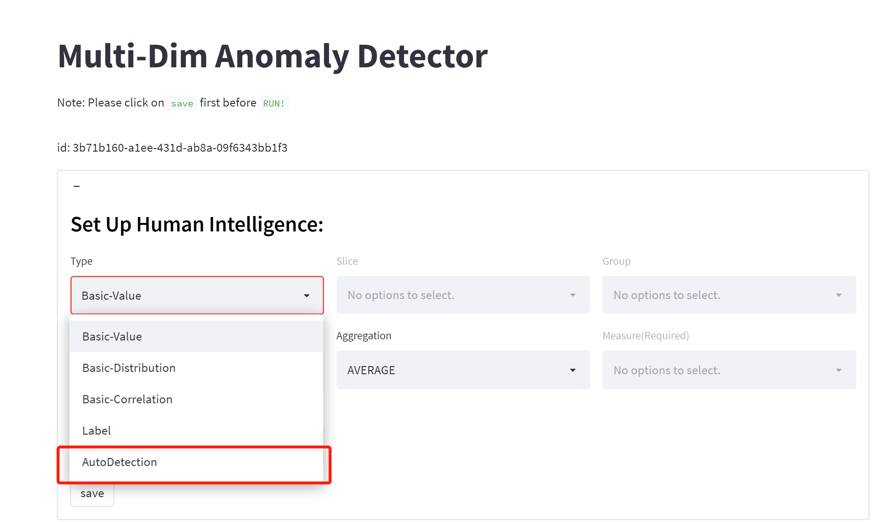
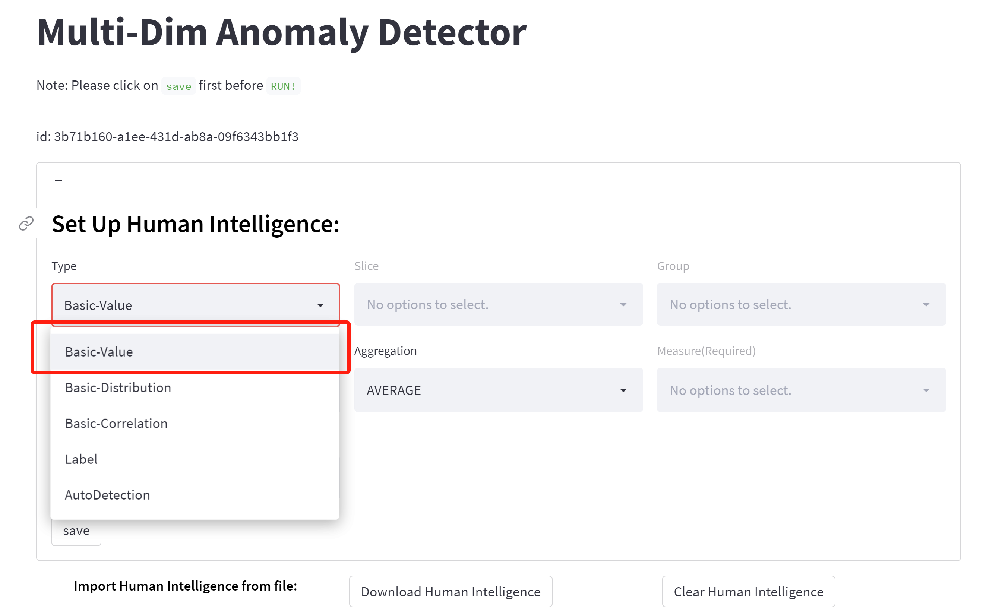
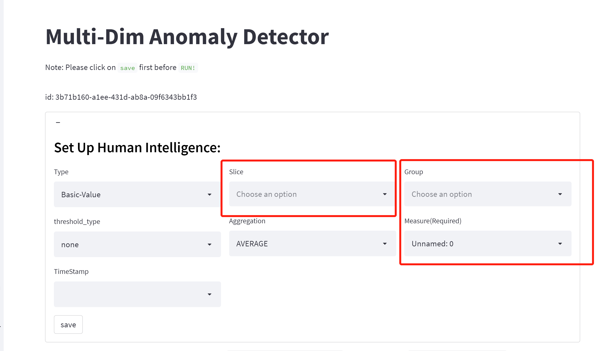
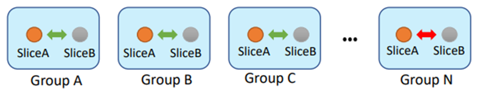
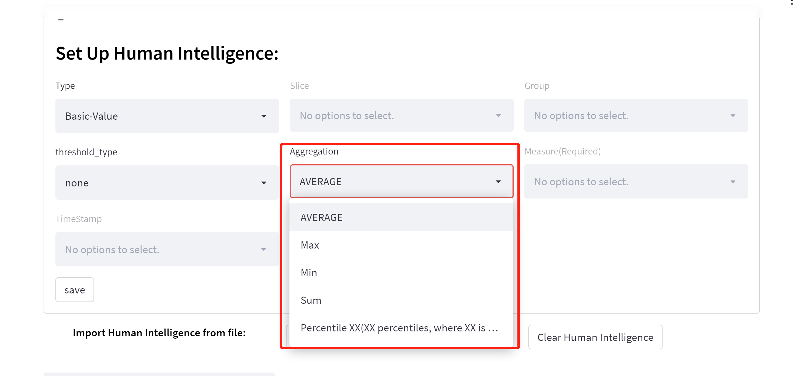

# 👉️1. How non-time series anomaly detection can help your business
Non-time series anomaly detection allows companies to identify or predict abnormal patterns in unbounded data streams. Whether you are a large retailer identifying positive buying behaviors, a financial services provider detecting fraud, or a sustainability customer, identify and mitigate potential greenhouse gases from equipment. In this post, we walk through an AI and human combined pattern for detecting anomalies in tabular data.

# 📖️2. Step-by-Step Guidance
## 🛠️2.1 Upload Data

Upload your data files on the left panel of the portal.

Scenarios: a supermarket is now selling 18 fruits with different prices.

## 📌️2.2 Set Up Human Intelligence 

### ✏️Main Anomaly Types: 

We define several types of anomalies to address different application scenarios. 

#### 🔎️**Auto-detection:**  

**If you have no prior knowledge about anomalies like human intelligence and pre-labels**, we will suggest you use this type; This is an auto-detection model that is an unsupervised model applied to whole data. Users who want to combine all columns as dimensions could choose auto-detection without needing to fill in other content.

#### **🔎️Basic value/Extreme value:**

1.  this is a human intelligence-combined anomaly detection. For users to want to have some filtered conditions, user should choose **type: basic value**, we designed a SQL-like config module. It is composed of 4 basic conceptions, including **group, slice, measure**. Our model will point out that significantly deviating from the mean value are anomalies. 

   

   #### 💡️Measure: 

   This is a required numerical content, indicating an intuitive measure of anomalies. For example, fruit price is a measure.

   

   #### 💡️Group: 

   We separate data into different subgroups and conduct detection within each subset. Each group is separated/isolated from another group. For example, 

   1. **Group:** Item name: Pomegranate, Pear, Grapes, Apple, Lemon, Jonagold Apple, Peach, Kiwi, Melon, Banana, White Grape, Plum, Orange, Apricot, Mango, Watermelon, Pineapple, Organic Watermelon.  

   **Note:** If you did not specify the group and slice, the model will not look them at all.

   #### 💡️Slice: 

   We slice each group of data, then aggregate the data to slice level and conduct anomaly detection. With slice, the model will looking for anomaly based on your slice, all other dimensions also be take into considerations. For example, slice by production region, which include three regions: 

   1. Shanghai
   2. Beijing
   3. Shenzhen

   If users choose the production region as a slice,so for group 1, will be:

   1. Shanghai: Pomegranate, Pear, Grapes, Apple, Lemon, Jonagold Apple, Peach, Kiwi, Melon, Banana, White Grape, Plum, Orange, Apricot, Mango, Watermelon, Pineapple,Organic Watermelon.
   2. Beijing: Pomegranate, Pear, Grapes, Apple, Lemon, Jonagold Apple, Peach, Kiwi, Melon, Banana, White Grape, Plum, Orange, Apricot, Mango, Watermelon, Pineapple,Organic Watermelon.
   3. Shenzhen: Pomegranate, Pear, Grapes, Apple, Lemon, Jonagold Apple, Peach, Kiwi, Melon, Banana, White Grape, Plum, Orange, Apricot, Mango, Watermelon, Pineapple,Organic Watermelon.

   #### 💡️Threshold_type(New!): 

   We now support user's 10X values' requirement, when you select 'normal_multiples' in threshold_type and give a value in 'mutiples_value', e.g. 10, we would treat 10 times value change as anomaly, and when timestamp column is given , data would be sorted before the anomaly detection. 

### ✏️Other Anomaly Types:

#### **🔎️Distribution anomaly:** 

The algorithm identifies anomalies as the following anomaly subtypes

o  **Point anomaly**: Points that cannot be categorized into any dense clusters are anomalies. 

o  **Change point anomaly**: Data can be constructed as a time series and some change points deviating from the historical trend/distribution are anomalies. 

o  **Slice anomaly**: Data are divided into different slices (e.g., different regions) first. 

#### **🔎️Correlation**: 

We assume that under normal conditions the relationship between two slices of different groups is constant. 

o  **TS**: Temporal correlation is used to measure the relationship between two slices in different groups. Anomalies are those few pairs of slices that significantly deviate from the majority. 

o  **Non-TS**: Distribution of each slice is estimated, and the similarity between estimated distributions is used to measure the relationship between two slices. The minor relationships are anomalies. 

#### **🔎️Label**

Users can also label some samples based on the platform’s outputs to refine the data. To improve the detection performance further, our platform has a semi-supervised learning process to make use of the additional labeled data.

## 🎉️2.3 Aggregation method: 
This is only applicable to measure column. 
1. Average:(Default) this is only applicable to measure column. 

2. Max

3. Min

4. Sum

5. Percentile

   

# 🎯️ 3. Result & Latency
- Results

Click the ‘Run’ button to get the anomaly detection result. A detection result saved as a tabular table includes the following attributes:

§ **Anomaly:** (Boolean) The record is detected as anomaly (`True`) or normal (`False`).

§ **Explanation:** (Dictionary) The reason why the algorithm detects it as an anomaly.

§ **Anomaly Score:** (Float) Anomaly score ranges from 0 to 1, indicating the degree of the anomaly. 

More details about the `Explanation` field above are also available:

§ **Type**: (String) The anomaly type. (i.e., `Value`, `Distribution`, or `Correlation`)

§ **sub_type**: (String) Anomaly subtype. Only the `Distribution` Type has subtype, it can be `PointAnomaly`, `ChangePoint`, or `SliceAnomaly`.

§ **description**: (String) Brief description of the anomaly.

§ **details**: (Dictionary) Detailed information about the anomaly according to the anomaly type.

§ **hit_rule**: (String) Indicating which rule was violated.

§ **confidence**: (Float) Probability to be an anomaly. (0 for all normal data).

**Results Sample 1:**

[ "details": {**"value": 17.98**, "expected_lower_bound":  19.414667144463266, "expected_upper_bound": 19.819773533502833}]

**Results Sample 2:**

["details": {"**value": 16.98**, "expected_lower_bound": 18.235179167993103, "expected_upper_bound": 18.71624940343547}]

- **Latency**

The latency of our unsupervised model on the 100k dataset would take about 12s for training and inference. And the latency of rule processing might be unstable depending on their customized selection, basically it would take about 1s for each rule.

# 🤹️ 4. Best Practice

- **Scenario A:** 

If you have clear definition about the anomaly, for example, 10 times value  changes are anomalies. Define a few clear labeling rules and run the model to get the result. The pruning model would be helpful to filter the false positives.

- **Scenario B:**

If you don’t have much context about the data, and not sure how to define a rule, you can use **auto-detection** to get an initial result and check the result by the "explanation" column, you would find some false positives or false negatives based on your knowledge, and then you can translate your knowledge to a labeling rule, and then feed them as an extra input for the model, and our model would use them to modify the detect results. In this way, you are using the rule like providing feedback without labeling any columns, just telling that there could be anomalies. And of course, if you would rather provide label feedback you can give us feedback labels directly.

 

# 👉️**5**. FAQ

1. Why we advice to combine human intelligence with our unsupervised models?

   Including too many irrelevant/useless fields will make the model harder to learn, even failure. Therefore, we suggest selects some informative fields based on knowledge before applying the model.

2. Why we need to trim my datasets?

   Some metrics which may not relevant about the anomalies. Trim the metrics into only 10 or even less columns is our best practice.

3. what if my dataset are long tailed?

   Data distribution in real life are more likely to be long-tailed or heavy-tailed, and Gaussian-dist might not be the best choice to fit all data. However we can not exhaust all distributions since the motivation is not to find the best distribution to fit.

   So we recommend to weaken the conception of which distribution do we use since for long tailed dataset, instead, using "basic-value" to find those extreme values. 

   In future, we will offer a customized parameter for users to control the model sensitivity, this value is also existed in our timeseries service, which is within 0-1, a higher sensitivity value could lead to more anomalies. For example, sensitivity 0.5 correspond sigma 3, sensitivity 0.4 correspond sigma 4.

# 📁️6. Key Resource

- **[Demo Site](https://nontsad.azurewebsites.net/)**

