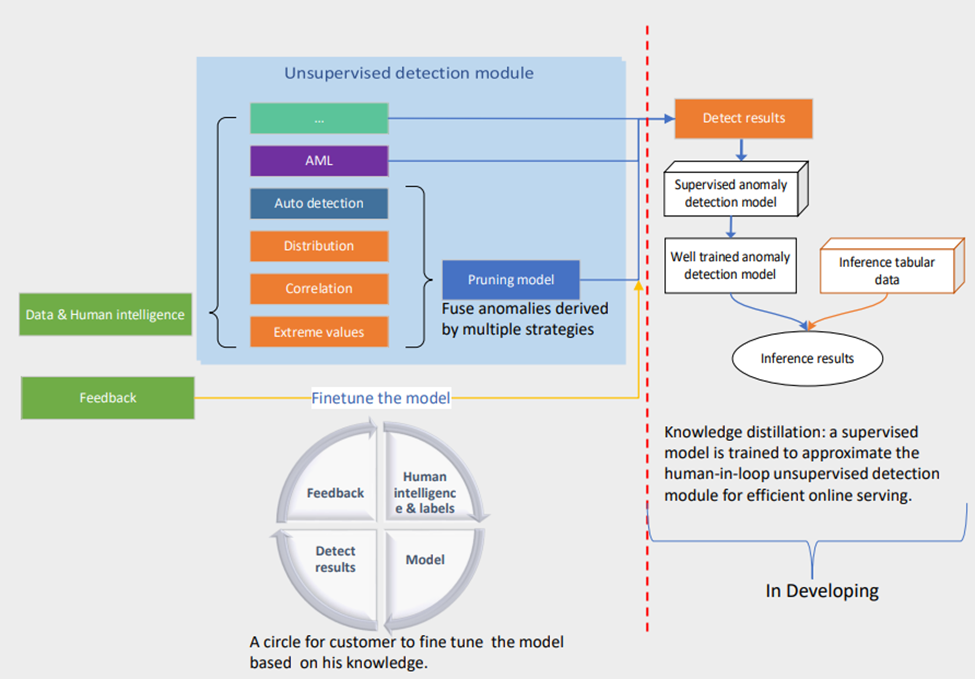
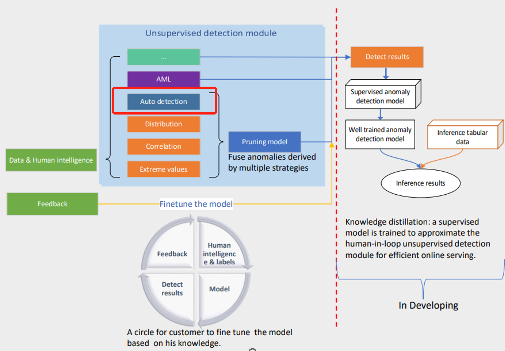

# 👉️1. How non-time series anomaly detection can help your business
Non-time series anomaly detection allows companies to identify or even predict abnormal patterns in unbounded data streams. Whether you are a large retailer identifying positive buying behaviors, a financial services provider detecting fraud, or a sustainability customer, identifying and mitigating potential greenhouse gases from equipment. In this post, we walk through an AI and human combined pattern for detecting anomalies in tabular data. 

# 📰️2. Step by Step Guidance
## 🛠️2.1 Upload Data

Upload your data files on the left panel of the portal.[Sample data](https://microsoftapc-my.sharepoint.com/:x:/g/personal/jinruishao_microsoft_com/EZMtoVACpTpEo03dh2FWiccBSexo8X5RzqBe7PMDNNNT-Q?e=AyoShL)

Scenarios: a supermarket is now selling 18 fruits with different prices.

## 📌️2.2 Set Up Human Intelligence 

### Anomaly type: 

We define several types of anomalies to address different application scenarios. Please refer to the next section for more details. 

1. 🔎️**Auto anomaly detection:** **If no prior knowledge about anomalies like human intelligence and pre-labels**, we will suggest you to use this type; This is an auto-detection model that is an unsupervised model applied on whole data.  For users who want to combine all columns as dimensions, they could choose auto detection and no need to fill other content.

   

2. **🔎️Basic value/Extreme value:** this is a human intelligence-combined anomaly detection. For users to want to have some filtered conditions, user should choose **type: basic value**, we designed a SQL-like config module. It is composed of 4 basic conceptions, including group, slice, measure, and anomaly type. we will use the below scenario as an example. Our model will point that significantly deviate from the mean value are anomalies, for example out of +/-3 sigma of an estimated distribution. 

3. **🔎️Distribution anomaly:** the algorithm identifies anomalies as the following anomaly subtypes

   o  **Point anomaly**: Points that cannot be categorized into any dense clusters are anomalies. 

   o  **Change point anomaly**: Data can be constructed as a time series and some change points deviating from the historical trend/distribution are anomalies. 

   o  **Slice anomaly**: Data are divided into different slices (e.g., different regions) first. 

4. **🔎️Correlation**: we assume that under normal conditions the relationship between two slices of different groups is constant. 

   o  **TS**: Temporal correlation is used to measure the relationship between two slices in different groups. Anomalies are those few pairs of slices that significantly deviate from the majority. 

   o  **Non-TS**: Distribution of each slice is estimated, and the similarity between estimated distributions is used to measure the relationship between two slices. The minor relationships are anomalies. 

5. **🔎️Label**: users can also label some samples based on the platform’s outputs to refine the data. To improve the detection performance further, our platform has a semi-supervised learning process to make use of the additional labeled data.

### 💡️Measure: 

This is a required numerical content, indicating an intuitive measure of anomalies. For example, fruit price is a measure.

### 💡️Group: 
We separate data into different subgroups and conduct detection within each subset. Each group is separated/isolated from another group. For example, 

1. **Group:** Item name: Pomegranate, Pear, Grapes, Apple, Lemon, Jonagold Apple, Peach, Kiwi, Melon, Banana, White Grape, Plum, Orange, Apricot, Mango, Watermelon, Pineapple, Organaic Watermelon.  

Note: If you did not specify the group and slice, the model will not look them at all.

### 💡️Slice: 
We slice each group of data, then aggregate the data to slice level and conduct anomaly detection. With slice, the model will looking for anomaly based on your slice, all other dimensions also be take into considerations. For example, slice by production region, which include three regions: 

1. shanghai
2. Beijing
3. Shenzhen

If users choose the production region as a slice,so for group 1, will be:

1. Shanghai: Pomegranate, Pear, Grapes, Apple, Lemon, Jonagold Apple, Peach, Kiwi, Melon, Banana, White Grape, Plum, Orange, Apricot, Mango, Watermelon, Pineapple,Organaic Watermelon.
2. Beijing: Pomegranate, Pear, Grapes, Apple, Lemon, Jonagold Apple, Peach, Kiwi, Melon, Banana, White Grape, Plum, Orange, Apricot, Mango, Watermelon, Pineapple,Organaic Watermelon.
3. Shenzhen: Pomegranate, Pear, Grapes, Apple, Lemon, Jonagold Apple, Peach, Kiwi, Melon, Banana, White Grape, Plum, Orange, Apricot, Mango, Watermelon, Pineapple,Organaic Watermelon.

## 🎉️Aggregation method: 
This is only aplicable to measure column. 
1. Average:(Default) this is only aplicable to measure column. 
2. Max
3. Min
4. Sum
5. Percentile

# 🎯️ 4. Result
Click the ‘Run’ button to get the anomaly detection result. A detection result saved as a tabular table includes the following attributes:

§ **Anomaly:** (Boolean) The record is detected as anomaly (`True`) or normal (`False`).

§ **Explanation:** (Dictionary) The reason why the algorithm detects it as an anomaly.

§ **Anomaly Score:** (Float) Anomaly score ranges from 0 to 1, indicating the degree of the anomaly. 

More details about the `Explanation` field above are also available:

§ **Type**: (String) The anomaly type. (i.e., `Value`, `Distribution`, or `Correlation`)

§ **sub_type**: (String) Anomaly subtype. Only the `Distribution` Type has subtype, it can be `PointAnomaly`, `ChangePoint`, or `SliceAnomaly`.

§ **description**: (String) Brief description of the anomaly.

§ **details**: (Dictionary) Detailed information about the anomaly according to the anomaly type.

§ **hit_rule**: (String) Indicating which rule was violated.

§ **confidence**: (Float) Probability to be an anomaly. (0 for all normal data).

# 🏷️ 5. Best Practice

- **Scenario A:** 

If you have clear definition about the anomaly, for example, 10 times value  changes are anomalies. Define a few clear labeling rules and run the model to get the result. The pruning model would be helpful to filter the false positives.

- **Scenario B:**

If you don’t have much context about the data, and not sure how to define a rule, you can use **auto-detection** to get an initial result and check the result by the "explanation" column, you would find some false positives or false negatives based on your knowledge, and then you can translate your knowledge to a labeling rule, and then feed them as an extra input for the model, and our model would use them to modify the detect results. In this way, you are using the rule like providing feedback without labeling any columns, just telling that there could be anomalies. And of course, if you would rather provide label feedback you can give us feedback labels directly.

 
